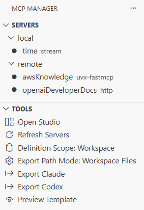
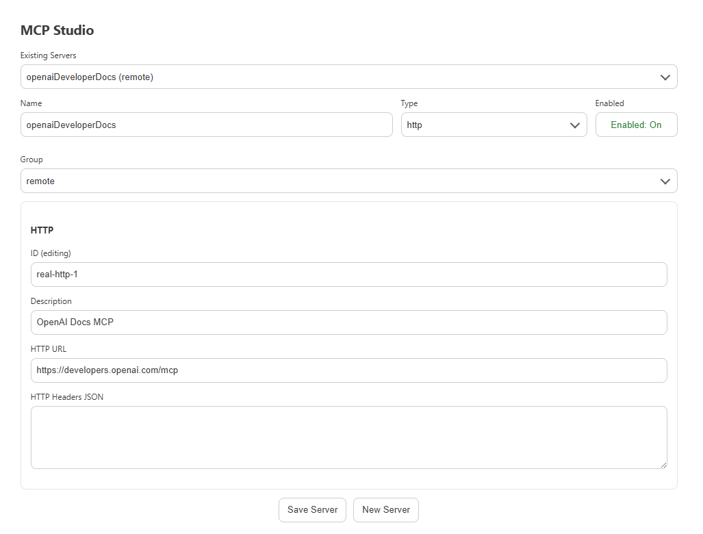
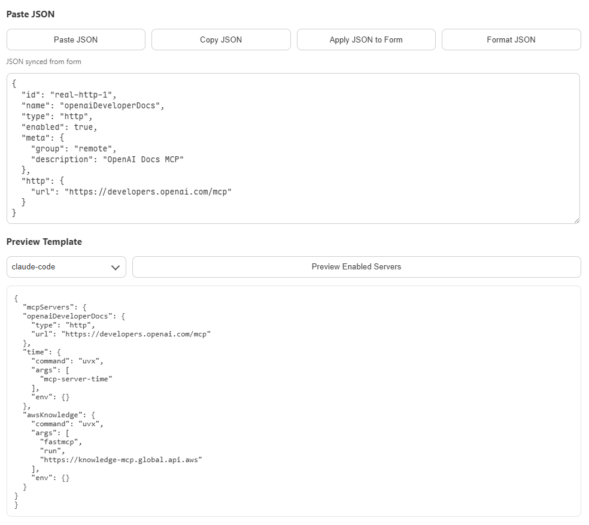

# MCP Config Manager

VS Code extension for managing MCP servers and exporting config for Claude Code and Codex.

## Highlights

- Manage servers in one place (create/edit/toggle/remove)
- Group servers and run group-level actions (start/stop/remove/rename)
- Export enabled servers to Claude Code (`.mcp.json`) or Codex (`.codex/config.toml`)
- Fully customizable export templates
- Configurable workspace export paths

## Screenshots

`01-servers-tools.png`  
Shows the sidebar structure and daily operation entry points:
- `Servers` grouped list and server status icons
- `Tools` actions such as Open Studio / Export / Preview



`02-studio-form.png`  
Shows server editing in MCP Studio:
- Name / Type / Enabled
- Group selection (existing or custom)
- HTTP/Runtime fields



`03-preview-template.png`  
Shows the full preview workflow in one screen:
- Upper section: **Paste JSON** editor content (`jsonEditor`)
- Lower section: **Preview Template** output (`preview`)
- Includes target selector (`claude-code` / `codex`) and preview action button



## Quick Start

1. Open **MCP Manager** in the Activity Bar.
2. Click **Open Studio** or **Add Server**.
3. Fill server details (`http`, `stream`, or `uvx-fastmcp`).
4. Enable servers and export:
   - **Export Claude**
   - **Export Codex**

## Core Features

- Sidebar container: `MCP Manager`
- Views:
  - `Servers`: grouped server list
  - `Tools`: studio/export/preview/settings actions
- Studio form:
  - Create/edit servers
  - Group selection (existing or custom)
  - JSON paste/apply/format helpers
- Runtime state model:
  - Definitions in settings (`mcpConfigManager.servers`)
  - Enabled state in extension local state

## Export Paths

When `mcpConfigManager.export.writeToWorkspace` is `true`:

- Claude Code path comes from `mcpConfigManager.export.claudeCodePath` (default: `.mcp.json`)
- Codex path comes from `mcpConfigManager.export.codexPath` (default: `.codex/config.toml`)

Path rules:

- Relative path: resolved from workspace root
- Absolute path: written directly to that location

## Template Engine

Export rendering is template-driven.

### Template Configuration

Set templates via string settings:

- `mcpConfigManager.export.claudeCodeTemplate`
- `mcpConfigManager.export.codexTemplate`

Current behavior:

- Supported: template string in settings
- Not supported: loading template from external file path

Example (`.vscode/settings.json`):

```json
{
  "mcpConfigManager.export.codexTemplate": "# Codex MCP config\\n{{#each servers}}[mcp_servers.{{tomlKey name}}]\\n{{#if resolved.command}}command = {{toml resolved.command}}\\n{{/if}}{{/each}}"
}
```

### Template Context

- `servers`: `Array<McpServer & { resolved: object }>`
- `servers_by_name`: `{ [name: string]: McpServer & { resolved: object } }`
- `servers_resolved_by_name`: `{ [name: string]: resolvedConfig }`
- `target`: `claude-code | codex`
- `servers_raw_json`
- `servers_by_name_json`
- `servers_resolved_by_name_json`

### Syntax

- Variable: `{{path.to.value}}`
- Loop: `{{#each servers}} ... {{/each}}`
- Condition: `{{#if resolved.env}} ... {{/if}}`
- Helpers:
  - `{{json path}}`
  - `{{toml path}}`
  - `{{tomlKey path}}`

## Build

```bash
npm install
npm run compile
```

Press `F5` in VS Code to launch the Extension Development Host.
